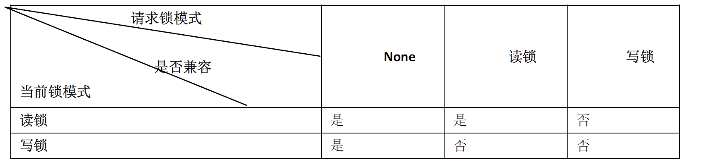

## 表类型(存储引擎)的选择

## 存储引擎概述
插件式存储引擎是mysql数据库的重要特性之一，用户可以根据应用的需要选择如何存储和索引数据 是否使用事务等。

mysql 5.0支持的存储引擎包括MyISAM InnoDB BDB MEMORY MERGE EXAMPLE (NDB Cluster) ARCHIVE CSV BLACKHOLE FEDERATED等，其中InnoDB和BDB提供事务安全表，其他存储引擎都是非事务安全表。

## 各种存储引擎的特性 

|特点|MyISAM|InnoDB|MEMORY|MEREGE|NDB|
|:---|:---|:---|:---|:---|:----|
|存储限制|有|64TB|有|没有|有|
|事务安全| |支持|  | | |
锁机制|表锁|行锁|表锁|表锁|行锁|
|B树索引|支持|支持|支持|支持|支持|
|哈希索引| | | 支持| | 支持|
|全文索引|支持| | | | |
|集群索引| | 支持| | | |
|数据缓存| | 支持| 支持| | 支持|
|索引缓存|支持|支持|支持|支持|支持|
|数据可压缩|支持| | | | |
|空间使用|低|高|N/A|低|低|
|内存使用|低|高|中等|低|高|
|批量插入速度|高|低|高|高|高|
|支持外键| | 支持| | | |

 
使用myisam存储引擎的表在磁盘上分3个文件存储：
1. .frm 存储表定义
2. .MYD 存储表数据
3. .MYI 存储表索引
数据和索引放在不同的目录，平均分布io，获得更快的速度。

myisam的表支持3种不同的存储格式
1. 静态(固定长度)表 默认存储格式
2. 动态表
3. 压缩表

Innodb自增列必须是索引，如果是组合索引，自增列必须是组合索引的第一列。如果是组合索引，也必须是组合索引的第一列。

Mysql种支持外键的存储引擎只有Innodb，在创建外键的时候，要求父表必须有对应的索引，子表在创建外键的时候也会自动创建对应的索引 。
创建索引时，可以在指定删除 更新父表时，对子表进行相应的操作，包括restrict (no action) (set null) cascade.
restrict表示限制子表有关联记录的情况下，父表不允许更新；no action和restrict相同；cascade表示在更新或删除父表记录时，子表同步更新或删除对应记录；
set null表示父表在更新或删除记录时，子表对应的字段被set null。

Innodb有两种存储表和索引的方式：
1. 使用共享表空间存储 这种方式表结构存储在.frm文件中，数据和索引保存在innodb_data_home_dir和innodb_data_file_path定义的表空间中
2. 使用多表空间存储，这种方式创建的表结构存储在.frm文件中，每个表的数据和索引独立保存在.idb中。如果是分区表 ，每个分区对应独立的.ibd文件。

mysql定义表字段的字符集的语法：
```sql
alter table book modify name varchar(20) character set utf8; 
ALTER TABLE tbl_name CHANGE c_name c_name CHARACTER SET character_name [COLLATE ...];

``` 

# 索引的设计与使用

myisam和Innodb默认创建的都是BTree索引。mysql支持前缀索引，即对索引字段的前n个字符创建索引。mysql还支持全文索引，该索引可用于全文检索。
当前只有myisam支持全文索引，且只限于char varchar text列。
语法：
```sql
create [unique|fulltext|spatial] index index_name [using index_type] on table_name (index_col_name,...)
```
也可以用alter table添加索引，语法类似create index。
删除索引语法：
```sql
drop index index_name on table_name 
```

设计索引的原则：
1. 索引的搜索列，不一定是要选择的列。换而言之，最适合索引的列是出现在where子句后面的列，或连接子句中指定的列。即可用于筛选的列
2. 使用唯一索引。索引的列的基数越大，索引效果越好。
3. 使用短索引。如果对字符串列进行索引，应该指定前缀长度，只要有可能就这样处理。较小的索引设计磁盘io少，较短的值比较更快。更重要的是，对于较短的键值，索引高速缓存中的块可以容纳更多键值，mysql也可以在内存中容纳更多的值。
4. 不要过多索引。每个额外索引都要占用额外的磁盘空间，并降低写操作的性能。创建多余的索引给查询优化会带去更多的工作。
5. 对于Innodb的表，记录默认按照一定顺序保存，如果有明确定义的主键，按照主键顺序保存。如果没有，但是有唯一索引，按照唯一索引顺序保存。如果都没有，表中会自动生成内部列，按照这个列的顺序保存记录。按照主键或内部列访问是最快的，因此Innodb表尽量自己指定主键，如果表中有多个列都可以作为主键，选择最常作为访问条件的列为主键。 

##  BTREE索引与HASH索引

HASH 索引需要注意的特征：
1. 只能用于比较=或<=>操作符
2. 优化器不能使用HASH索引来加速ORDER BY操作
3. MySQL不能确认两个值之间大约有多少行 

而BTREE索引，当使用>,<,>=,<=,BETWEEN,!=或<>，或者like 'pattern'（其中pattern不以通配符开始）操作符，都可以使用相关列上的索引。

索引用于快速查找某一列中具有特定值的行。如果不用索引，mysql必须从第一条记录开始然后读完整张表直到找出相关行。表越大，花费时间越多。


#  视图
视图是一种虚拟存在的表。
视图相比普通表的优势：
1. 简单：使用视图的用户不关心后面对应的表结构，关联条件和筛选条件，对用户而言是已经过滤好的符合条件的结果集。
2. 安全：使用视图的用户只能访问他们被允许查询的结果集，对表的权限管理不能限制到某行某列，但是视图可以
3. 数据独立：一旦视图结构确定了，可以屏蔽表结构变化对用户的影响。

## 视图基本操作
创建或修改视图，删除视图，查看视图定义。
创建视图语法：
```sql
create [or replace] [algorithm={undefined|merge|temptable}] view view_name [(col_list)] as select_statement [with [cascade|local] check option ]
# 修改视图
alter [algorithm={undefined|merge|temptable}] view view_name [(col_list)] as select_statement [with [cascade|local] check option ]

```
[with [cascade|local] check option ]决定了是否允许更新数据使记录不在满足视图的条件。
1. local只要满足本视图条件就可以更新
2. cascade必须满足所有针对该视图的所有视图的 条件才能更新。

默认是cascade。

删除视图：
```sql
drop view [if exists ] view_name [,view_name] ... [restrict | cascade ]
```

# 事务控制和锁定语句
mysql支持对myisam和memory的表进行表级锁定，对BDB存储引擎进行页级锁定，对Innodb的表进行行级锁定。默认情况下，行锁和表锁都是自动获得的，无须额外的命令。
## LOCK TABLE与UNLOCK TABLE
 LOCK TABLES用于锁定当前线程的表。如果表被其他线程锁定，则当前线程等待，直到可以获取所有锁定为止。
 UNLOCK TABLES用于释放当前线程获得的任何锁定。当前线程执行另一个 LOCK TABLES时，或当与服务器的连接被关闭时，所有由当前线程锁定的表被隐含的解锁，具体语法如下：
 ```sql
LOCK TABLES table_name [AS alias] {READ [LOCAL ]|[LOW_PRIORITY] WTITE} [,table_name [AS alias] {READ [LOCAL ]|[LOW_PRIORITY] WTITE}]...
UNLOCK TABLES

```
myisam存储引擎只支持表级锁。
### mysql表级锁的锁模式
表共享读锁和表独占写锁
如下表所示：


由上表可知，对myisam表的读操作，不会阻塞对其他用户对同一表的读请求，但是阻塞对同一表的写请求；对myisam表的写操作，则会阻塞其他用户对同一表的读和写请求；myisam表的读操作和写操作之间，以及写操作之间是串行的！


