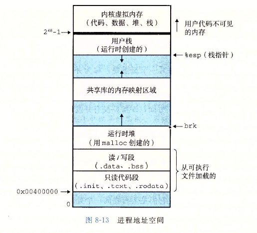

# 异常控制流(Exception Control Flow)
处理器的控制流：程序计数器记录的一个指令到下一个指令的过渡称为控制转移，完整的指令序列的控制转移就叫做处理器的控制流。

比如假定程序计数器的一个值序列为a0,a1,...,an,每个ak表示相应的指令的地址。从ak到a(k+1)的过渡称为控制转移，这样的控制转移序列就叫处理器的控制流。

## 异常
异常就是控制流中的突变，用来响应处理器状态的某些变化。
如图：

###  异常处理
系统中可能的每种异常都分配了一个唯一的异常号(非负整数).
系统在启动时(重启或加电开机),操作系统分配一张叫异常表的跳转表，表中每个表项都包含一个异常的处理程序地址。处理器检测到发生事件，并确定异常号，然后处理器触发异常，通过查询异常表，转到相应的异常处理程序中。

异常分类 ：中断(interrupt)、陷阱(trap)、故障(fault)、终止(abort)。

|类别|原因|异步/同步|返回行为|
|:---|:---|:---|:---|
|中断|来自I/O设备的异常|异步|总是返回到下一条指令|
|陷阱|有意的异常|同步|总是返回到下一条指令|
|故障|潜在可恢复的错误|同步|可能返回到当前指令|
|终止|不可恢复的错误|同步|不会返回|

陷阱是执行一条指令的结果。其最重要的用途是在用户进程和内核之间提供系统调用。如用户程序向内核请求服务，读文件(read) 创建新进程(fork) 加载新的程序(execve) 终止当前进程(exit)。这些都会导致系统调用。

## 进程
** 问题1：进程是什么？**

** 答：进程是运行中的程序，是操作系统分配资源和调度的基本单位。通过进程控制块来描述进程的当前情况和管理进程运行的信息。
包括：1)进程标识符(进程ID)； 2)进程上下文；3)进程调度信息，即进程当前状态和优先级等；4)进程控制信息。 **

** 问题2：进程如何状态转换？ **

** 答：进程有3种基本状态：就绪状态、运行状态、阻塞状态。就绪状态下的进程经过系统调度进入运行状态；运行状态下的进程由于时间片用完回到就绪状态，或由于发生某些事件(如发起I/O请求，访问的临界资源暂时不可得等)进入阻塞状态。阻塞状态下的进程，由于发生的事件已完成(如I/O请求完成，临界资源已可用等)继续进入就绪状态。
进程还有创建状态和终止状态。此外，进程还有一个重要操作--挂起操作。当该操作作用于进程，该进程将被挂起，意味着此时进程处于静止状。如果进程正在执行，则暂停执行。若原本处理就绪状态，则暂不接收调度。与挂起对应的操作是激活。
在它们的操作下，进程可能发生以下几种状态转换：
(1)活动就绪-->静止就绪 活动就绪状态的进程执行挂起操作进入静止就绪状态，该状态下的进程不接受操作系统调度
(2)活动阻塞-->静止阻塞 活动阻塞状态的进程执行挂起进入静止阻塞，静止阻塞的进程在所期待的事件出现后进入静止就绪状态
(3)静止就绪-->活动就绪 静止就绪的进程被激活
(4)静止阻塞-->活动阻塞 与(2)相反。
进程状态图参见:[进程状态图](https://blog.csdn.net/zpznba/article/details/88643348)
**

** 问题3：进程如何进行同步？**

** 答：进程同步是指对多个相关进程在执行次序上进行协调，使得并发执行的进程之间能按照一定的规则共享系统资源。可以通过信号量机制，即P、V操作来实现进程的同步。对信号量的P、V操作是不可中断的原子操作。
信号量分为整型信号量、记录型信号量、AND型信号量(将进程在整个运行过程中所需要的所有资源一次性全部分配给进程)。经典同步问题：生产者-消费者问题、读者-写者问题。 **

** 问题4：进程之间如何通信? **

** 答：1)共享内存，最快的ipc通信方式； 2)管道通信，管道分为匿名管道与命名管道，匿名管道只能一端读另一端写，且只用于父子进程通信，命名管道克服了这一限制；3)消息队列 4)套接字 5)内存映射(memory map)：进程通过把一个共享的文件映射到自己的进程地址空间来实现它；6)信号 ** 

** 问题4：操作系统如何调度进程？ **

** 答：**

进程提供给应用程序两个抽象：
1. 独立的逻辑控制流，这造成在同一时刻只有自己的程序独占的使用处理器
2. 私有的地址空间，这造成自己的程序独占的使用内存。

并发：进程的逻辑流在执行时间上重叠。
并行：进程的逻辑流在不同的处理器上并发。

私有的地址空间：在一台n位的机器上，地址空间是pow(2,n)个可能地址的集合(注：64位机器实际上只用到48位地址)。进程为每个程序提供私有的地址空间。一般而言，进程的地址空间的某个地址关联的内存字节对其他进程是不可访问的，从这个意义上看，该地址空间是私有的。
进程地址空间如图：

这里讨论的地址空间都是虚拟内存空间，通过共享内存机制可以打破这种虚拟空间的私有性。

用户模式与内核模式：限制一个应用可以执行和指令以及可以访问的地址空间范围。

在内核模式下进程可以执行任意指令，访问系统中任何内存位置。

在用户模式下进程不允许执行特权指令，如发起I/O操作，停止处理器，也不允许直接引用地址空间中内核区的代码和数据。

进程上下文：内核重启一个被抢占的进程所需的状态。它由一些对象组成(包括通用目的寄存器，浮点寄存器，程序计数器，用户栈，状态寄存器，内核栈及各种内核数据)

进程调度：内核决定抢占当前进程，并重新开始一个之前被抢占的进程。

内核调度一个新进程后，就会抢占当前进程，并使用上下文切换将处理器的控制转移到新的进程。

上下文切换：1）保存当前进程的上下文；2）恢复某个先前被抢占的上下文的进程；3）将控制传递给这个新恢复的进程

进程调度机制：
1. 排队器。将系统中的就绪进程按照一定的策略排成一个或多个队列，方便调度程序快速找到它。每当有进程进入就绪状态，就将其插入到就绪队列中。
2. 分派器。依据进程调度程序所选中的进程，将其从就绪队列取出，进行分派器到新选出进程间的上下文切换，将处理器的控制分配到新选出的进程。
3. 上下文切换器。 执行两对上下文切换操作。

### 进程调度方式
早期采用非抢占式，后引入抢占式。
1. 非抢占方式：一旦把处理器分配给某个进程，就一直运行，不因为时钟中断或其他原因抢占当前正在运行进程的处理器，直至该进程完成，或这发生某事件阻塞，才把处理器分配给其他进程。
可能引起调度的原因：1)当前进程执行完毕；2)当前进程发起I/O请求而暂停；3)在通信或同步时，执行了某种原语操作。

2. 抢占式：该方式允许调度程序依据某规则去暂停正在执行的进程，将处理器重新分配给另一个就绪进程。
抢占原则：
(1) 优先权原则
(2) 短进程优先原则（指需运行的时间短）
(3) 时间片原则

### 轮转调度算法
基于时间片的轮转调度算法，采取了非常公平的处理机分配方式，让就绪队列的每个进程每次仅运行一个时间片。
操作系统将所有的就绪进程按照FCFS(先来先服务)策略排成一个就绪队列，把CPU分配给队首进程，让它执行一个时间片。当它运行完毕，再把cpu给就绪队列中新的队首进程，也执行一个时间片。

进程切换时机：(1)如果一个时间片还没用完，进程已经执行完成，就立即激活调度程序，把它从就绪队列删除，再调度就绪队列中的队首进程运行，并启动新的时间片；(2)在一个时间片用完，计时器中断处理程序被激活。如果进程没运行完，把该进程添加到就绪队列末尾。

### 优先级调度算法
轮转调度算法中隐含所有进程优先级相同这一假设。

1. 非抢占式优先级调度算法。一旦处理器分配给就绪队列中优先级最高的进程后，该进程就一直运行到结束，或者因发生某些事件导致阻塞，操作系统才将处理器分配给下一个优先级最高的进程。

2. 抢占式优先级调度算法。 只要在某个进程运行期间，出现了优先级更高的进程，调度程序就立即将处理器分配给新的优先级最高的进程。所以每次有进程加入就绪队列，就将该进程与正在运行中的进程竞争，优先级高的进程获得处理器分配。

优先级包括静态优先级和动态优先级。静态优先级是在进程创建时所确定，在进程的整个运行期间保持不变。

确定优先级的依据：(1)进程类型，通常系统进程优先级更高 (2)进程对资源的需求，对要求资源少的进程通常赋予高优先级 (3)用户要求。
静态优先级的一个缺点是低优先级的进程可能很长事件无法被调度。

动态优先级是在进程创建之初初始化一个优先级，然后其优先级随着进程的推进获得等待事件的增加而改变，以便获得更高的调度性能。

### 多队列调度算法
前面2种调度算法，在系统中只有一个就绪队列，其调度能力固定且单一。多队列调度算法是将系统中的进程就绪队列分为若干个，将不同类型或性质的进程分配到不同的就绪队列里，不同的就绪队列采用不同的调度算法，一个就绪队列的进程可设置不同优先级，不同就绪队列本身也能设置优先级。

### 多级反馈队列
前面3种调度算法，如果不指明进程长度(进程所需执行时间)，则短进程优先和基于进程长度的抢占式调度算法都无法使用。
其机制如下：（1）设置多个就绪队列。 为每个就绪队列设置不同的优先级。为不同的队列种的进程赋予的执行时间片的大小也不同，优先级越高的队列时间片越小。比如第二个队列的时间片长度是第一个队列的2倍，第n+1个队列的时间片长度是第n个队列的2倍。
（2）每个队列都采用FCFS算法。新进程进入内存后，先进入第一队列的末尾，按照FCFS的策略等待调度。当轮到该进程执行时，若在这个时间片内执行结束，则撤离系统，否则调度程序将其添加到第二队列的队尾，以此类推。当进程被降到第n队列后，在该队列采取轮转调度算法。
（3）按照队列优先级调度。 调度程序先让第一队列种的进程运行，只有第一队列空闲时才调度第二队列种的进程；如果处理器正在为第i队列中的进程服务时又有新进程进来，就将当前进程放回到第i队列的末尾，把处理器分配给新来的优先级高的进程。

### 基于公平原则的调度算法
以上调度算法所保证的只是优先级，如优先级算法时优先级最高的就绪进程先运行，但是不保证进程占用了多少处理器时间。也不考虑调度的公平性。
（1）保证调度算法：这是另一种调度算法，它保证优先运行，而是明确的性能保证。比较容易的实现是处理器分配的公平性。如果在系统中有n个相同类型的进程同时运行，为了公平，必须保证每个进程都获得相同的处理器时间1/n。
（2）公平分享调度算法

## 实时调度系统
实时调度需要有关任务提供的信息：（1）就绪时间 （2）开始截至时间和完成截至时间 （3）处理时间 （4）资源要求 （5）优先级
实时调度算法分类：

按照调度方式
1. 非抢占式调度算法：非抢占式轮转调度算法和非抢占式优先级调度算法
2. 抢占式调度算法：基于时钟中断的的抢占式优先级调度算法，在某个实时任务到达后，若优先级高于当前任务的优先级，并不立即抢占当前任务的处理器，而等到时钟发生中断后，调度程序剥夺当前程序的执行，将处理器分配给高优先级任务；
立即抢占的优先级调度算法。这种策略中，一旦出现外部中断，只要当前任务不在临界区，就能立即剥夺当前任务的执行，把处理机分配给请求中断的紧急任务。

### 最早截止时间优先算法(Earliest Deadline First)
这个算法是根据任务的截止时间来确认任务的优先级，任务的截止时间越早，优先级越高。最高截止时间优先算法既可以用于抢占式调度，又可以用于非抢占式调度。
1. 非抢占式调度用于非周期实时任务

2. 抢占式调度方式用于周期实时任务

### 最低松弛度优先算法(Least Laxity First)
这个算法的优先级根据任务的紧急（或松弛）程度来确定。任务越紧急，优先级越高。实现这个算法要求系统中有一个按照松弛度排序的实时就绪队列。这个算法主要用于可抢占调度方式中。

### 优先级倒置
由于进程之间访问临界资源的互斥性，低优先级的进程先进入就绪状态占用了临界资源，高优先级的进程进入就绪队列后抢占运行权，然而由于访问临界资源不可得进入阻塞状态，仍然将运行权还给低优先级的进程，这就造成优先级倒置的现象。
一个比较使用的解决方法：基于动态优先级集成，当高优先级进程要进入临界区，在访问临界资源时，若低优先级进程正在使用该资源，一方面将高优先级进程阻塞，另一方面将高优先级进程的优先级赋予该占用资源的低优先级进程，一直保持到低优先级进程使用完临界资源。这样可以不让优先级位于这两者之间的进程插入进来，延缓低优先级进程推出临界区。

** 注:这个github仓库中有一些基本的进程调度算法的[java实现](https://github.com/qwhai/ProcessSchedulingRules.git) **

## 死锁
什么是死锁？
产生死锁的原因？
死锁产生的4个必要条件？

有关死锁的知识要点：[死锁要点](https://blog.csdn.net/hd12370/article/details/82814348)

## 信号

** 问题1：什么时linux信号？**
** 答：linux中，信号就是一条小消息，通知一个进程系统中发生了某种类型的时间。每种信号类型都对应于一种系统事件。信号提供了一种机制，通知用户进程发生了这些异常。如一个进程试图除0，则内核给该进程 发送一个SIGFPE信号。在linux系统中可以通过指令(kill -l)来查看所有的信号类型。 **
各个信号类型及对应事件如下表：

传送一个信号到目的进程包括两个步骤：
1. 发送信号：指内核通过更新目的进程上下文的某个状态值，发送一个信号给目的进程。发送信号可能有这样两个原因:1)内核检测到某个事件发生，2)一个进程调用了kill函数，显式要求内核给某个目的进程发送一个信号。
2. 接收信号：指目的进程被内核强迫以某种方式对信号做出反应，它就接收了信号。进程可忽略此信号，或者通过执行一个信号处理程序的用户层函数来捕获这个信号。

一个发出但是未被接收的信号叫做待处理信号，信号不会排队，也就是说任何时刻一个进程每种待处理信号都只能有一个。在这个待处理信号还没接收的时候发送同一类型的信号，这个时候会被丢掉。另外，进程可以设置对某一类型信号的阻塞，设置了阻塞之后，该进程就不再接收这种类型的信号了。

进程接收信号的时机：在内核把进程从内核态切换到用户态时，会检查进程p的未被阻塞的待处理信号的集合。如果这个集合非空，那么内核选择集合中的某个信号k，并强制p接收k。每个信号类型都有一个预定义的默认行为：
(1)进程终止 （2）进程终止并转储内存 （3）进程挂起直到被SIGCONT信号重启 （4）进程忽略该信号。
用户可以通过编写信号处理程序来改变信号的默认行为，信号处理程序与主程序是并发的，共享同样的全局变量，所以处理程序要尽可能简单，不要在处理程序中做太多事情，处理程序中只调用异步信号安全的函数。

# 虚拟内存